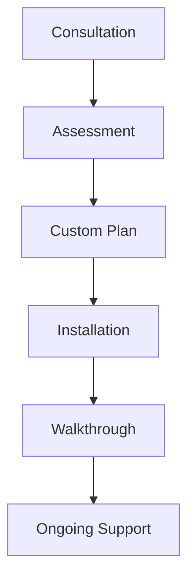

## Overview

Safe Start Child follows a structured process to make your home safe for little ones. You start with a personalized consultation and end with a fully secured environment plus ongoing support. This ensures every detail matches your home layout and family's needs.

<Callout kind="info">
Every project begins with your unique home in mind. Our experts assess risks specific to your space before recommending solutions.
</Callout>

## The Step-by-Step Process

Follow these steps to complete your childproofing journey.

<Steps>
  <Step title="Schedule Consultation" icon="calendar">
    Contact us to book a free initial call. Discuss your home layout, children's ages, and concerns.

    Use our [contact form](https://safestartchild.com/contact-us/) or call directly.
  </Step>

  <Step title="On-Site Assessment" icon="search">
    Our certified babyproofer visits your home. We identify hazards in kitchens, stairs, bathrooms, and more.

    Expect a 60-90 minute walkthrough.
  </Step>

  <Step title="Custom Plan & Quote" icon="file-text">
    Receive a detailed proposal with selected products, installation timeline, and pricing.

    Review and approve before we proceed.
  </Step>

  <Step title="Professional Installation" icon="tools">
    We install all hardware on the scheduled day. Your home stays functional during the process.
  </Step>

  <Step title="Final Walkthrough & Support" icon="check-circle">
    Test all installations together. Get maintenance tips and 24/7 support access.
  </Step>
</Steps>

## Customization by Home Type

Tailor the process to your living situation.

<Tabs>
  <Tab title="Single-Story Home" icon="home">
    Focus on room access, cabinets, and outlets. Typical timeline: 1 day install.
  </Tab>

  <Tab title="Multi-Story Home" icon="building-2">
    Prioritize stairs and upper-level railings. Add custom gates for landings.
  </Tab>

  <Tab title="Apartment" icon="apartment">
    Portable solutions like pressure-fit gates. Landlord-approved anchors.
  </Tab>
</Tabs>

## Safety Products Selection

We choose durable, stylish products matched to your decor.

<Columns cols={3}>
  <Card title="Baby Gates" icon="shield" href="#">
    Hardware-mounted for stairs, pressure-fit for doorways. Colors to match woodwork.
  </Card>

  <Card title="Cabinet Latches" icon="lock">
    Magnetic or mechanical. Invisible installation preserves aesthetics.
  </Card>

  <Card title="Outlet Covers & Edge Guards" icon="plug">
    Tamper-proof plugs and soft corner protectors. Easy adult access.
  </Card>
</Columns>

## Installation Timeline

| Phase | Duration | What Happens |
|-------|----------|-------------|
| Assessment | 1-2 hours | Hazard mapping |
| Product Prep | 2-3 days | Ordering & delivery |
| Installation | 4-8 hours | Full setup |
| Follow-up | Ongoing | Check-ins at 1 & 6 months |

## Post-Installation Maintenance

Keep your setup effective over time.

<ExpandableGroup>
  <Expandable title="Monthly Checks" default-open="true">
    Test gates for secure fit. Wipe latches clean. Replace worn outlet covers.
  </Expandable>

  <Expandable title="Seasonal Adjustments">
    Adjust gates as children grow. Re-secure anchors after moves.
  </Expandable>

  <Expandable title="Troubleshooting Common Issues">
    Gate won't latch? Check alignment. Loose hardware? Tighten with provided tools.
  </Expandable>
</ExpandableGroup>

<Callout kind="tip">
Ready to start? [Schedule your consultation](https://safestartchild.com/contact-us/) today for peace of mind.
</Callout>